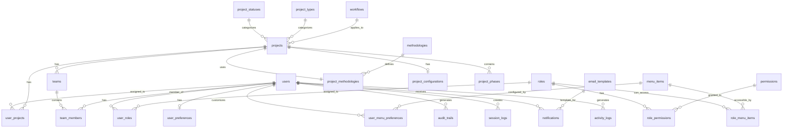
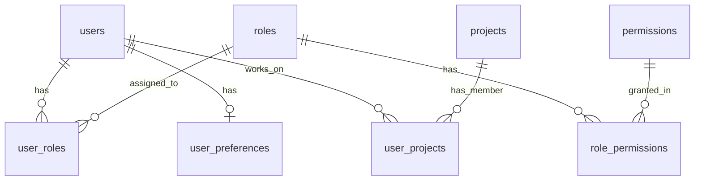
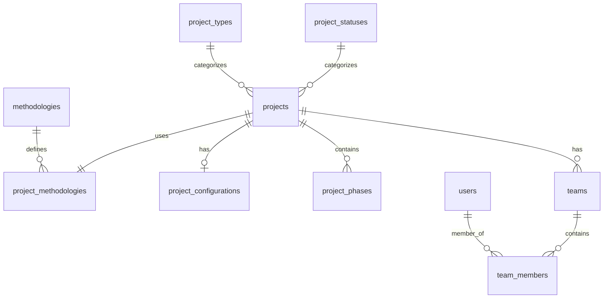
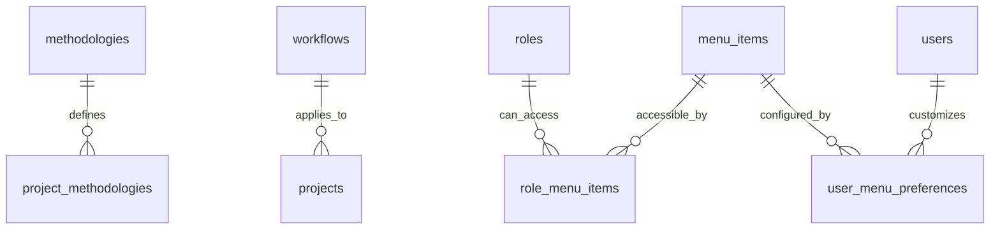

# Core Tables ER Diagram & Schema
**Project:** Project Nidus
**Date:** 2025-11-15
**Version:** 1.0
**Database:** PostgreSQL (via Supabase)
**Tables Covered:** 28 Core Tables

---

## 📋 Overview

This document provides complete Entity Relationship diagrams and detailed schema definitions for all 28 core tables in Project Nidus. These tables form the foundation of the system and are methodology-agnostic.

---

## 📊 Table Categories

| Category | Tables | Purpose |
|----------|--------|---------|
| System Core | 8 | System-level functionality and tracking |
| User & Access | 7 | Authentication, authorization, user management |
| Project Core | 8 | Core project management functionality |
| Configuration & Menu | 5 | System configuration and UI customization |
| **Total** | **28** | **Foundation tables** |

---

## 🗺️ Complete ER Diagram

### High-Level Entity Relationships



---

## 📚 Category 1: System Core Tables (8 tables)

### 1.1 database_tables

**Purpose:** Central registry of all database tables in the system

```sql
CREATE TABLE database_tables (
    -- Primary Key
    id UUID PRIMARY KEY DEFAULT uuid_generate_v4(),

    -- Table Information
    table_name VARCHAR(100) UNIQUE NOT NULL,
    table_description TEXT NOT NULL,
    schema_name VARCHAR(100) DEFAULT 'public',

    -- Classification
    is_system_table BOOLEAN DEFAULT FALSE,
    is_active BOOLEAN DEFAULT TRUE,
    table_category VARCHAR(50),  -- 'system', 'user', 'project', 'methodology', etc.

    -- Metadata
    row_count_estimate BIGINT,
    last_analyzed_at TIMESTAMP,

    -- Audit Fields
    created_at TIMESTAMP DEFAULT NOW(),
    created_by UUID REFERENCES users(id),
    updated_at TIMESTAMP DEFAULT NOW(),
    updated_by UUID REFERENCES users(id),
    is_deleted BOOLEAN DEFAULT FALSE,
    deleted_at TIMESTAMP,
    deleted_by UUID REFERENCES users(id)
);

-- Indexes
CREATE INDEX idx_database_tables_category ON database_tables(table_category) WHERE is_deleted = FALSE;
CREATE INDEX idx_database_tables_is_system ON database_tables(is_system_table) WHERE is_deleted = FALSE;
CREATE UNIQUE INDEX idx_database_tables_name_unique ON database_tables(table_name) WHERE is_deleted = FALSE;

-- Triggers
CREATE TRIGGER trg_database_tables_before_insert
    BEFORE INSERT ON database_tables
    FOR EACH ROW EXECUTE FUNCTION trigger_set_created_fields();

CREATE TRIGGER trg_database_tables_before_update
    BEFORE UPDATE ON database_tables
    FOR EACH ROW EXECUTE FUNCTION trigger_update_audit_fields();

-- Comments
COMMENT ON TABLE database_tables IS 'Central registry of all database tables';
COMMENT ON COLUMN database_tables.table_name IS 'Physical table name in database';
COMMENT ON COLUMN database_tables.table_description IS 'Human-readable description of table purpose';
COMMENT ON COLUMN database_tables.is_system_table IS 'TRUE if this is a system/infrastructure table';
```

---

### 1.2 audit_trails

**Purpose:** System-wide audit log for all table changes

```sql
CREATE TABLE audit_trails (
    -- Primary Key
    id UUID PRIMARY KEY DEFAULT uuid_generate_v4(),

    -- What Changed
    table_name VARCHAR(100) NOT NULL,
    record_id UUID NOT NULL,
    operation VARCHAR(20) NOT NULL,  -- 'INSERT', 'UPDATE', 'DELETE'

    -- Who Changed It
    user_id UUID REFERENCES users(id),
    user_email VARCHAR(255),

    -- When Changed
    changed_at TIMESTAMP DEFAULT NOW(),

    -- What Was Changed
    old_values JSONB,  -- Previous values (for UPDATE/DELETE)
    new_values JSONB,  -- New values (for INSERT/UPDATE)
    changed_fields TEXT[],  -- Array of field names that changed

    -- Context
    ip_address INET,
    user_agent TEXT,
    session_id UUID,

    -- Metadata
    created_at TIMESTAMP DEFAULT NOW(),
    created_by UUID REFERENCES users(id)
);

-- Indexes
CREATE INDEX idx_audit_trails_table_name ON audit_trails(table_name);
CREATE INDEX idx_audit_trails_record_id ON audit_trails(record_id);
CREATE INDEX idx_audit_trails_user_id ON audit_trails(user_id);
CREATE INDEX idx_audit_trails_changed_at ON audit_trails(changed_at DESC);
CREATE INDEX idx_audit_trails_operation ON audit_trails(operation);

-- Partitioning (monthly)
-- Note: This would be implemented with partition tables
-- Example: audit_trails_2025_11, audit_trails_2025_12, etc.

-- Triggers
CREATE TRIGGER trg_audit_trails_before_insert
    BEFORE INSERT ON audit_trails
    FOR EACH ROW EXECUTE FUNCTION trigger_set_created_fields();

-- Comments
COMMENT ON TABLE audit_trails IS 'System-wide audit log for all data changes';
COMMENT ON COLUMN audit_trails.operation IS 'Type of operation: INSERT, UPDATE, or DELETE';
COMMENT ON COLUMN audit_trails.old_values IS 'JSONB snapshot of record before change';
COMMENT ON COLUMN audit_trails.new_values IS 'JSONB snapshot of record after change';
```

---

### 1.3 session_logs

**Purpose:** User session tracking and management

```sql
CREATE TABLE session_logs (
    -- Primary Key
    id UUID PRIMARY KEY DEFAULT uuid_generate_v4(),

    -- User Information
    user_id UUID REFERENCES users(id),
    user_email VARCHAR(255),

    -- Session Details
    session_token UUID UNIQUE NOT NULL,
    refresh_token UUID,

    -- Session Lifecycle
    started_at TIMESTAMP DEFAULT NOW(),
    last_activity_at TIMESTAMP DEFAULT NOW(),
    ended_at TIMESTAMP,

    -- Session Context
    ip_address INET,
    user_agent TEXT,
    device_type VARCHAR(50),  -- 'desktop', 'mobile', 'tablet'
    browser VARCHAR(100),
    operating_system VARCHAR(100),
    location_country VARCHAR(100),
    location_city VARCHAR(100),

    -- Session Status
    is_active BOOLEAN DEFAULT TRUE,
    logout_reason VARCHAR(100),  -- 'user_logout', 'timeout', 'forced', 'expired'

    -- Audit Fields
    created_at TIMESTAMP DEFAULT NOW(),
    created_by UUID REFERENCES users(id)
);

-- Indexes
CREATE INDEX idx_session_logs_user_id ON session_logs(user_id);
CREATE INDEX idx_session_logs_session_token ON session_logs(session_token);
CREATE INDEX idx_session_logs_started_at ON session_logs(started_at DESC);
CREATE INDEX idx_session_logs_is_active ON session_logs(is_active) WHERE is_active = TRUE;
CREATE INDEX idx_session_logs_last_activity ON session_logs(last_activity_at DESC);

-- Triggers
CREATE TRIGGER trg_session_logs_before_insert
    BEFORE INSERT ON session_logs
    FOR EACH ROW EXECUTE FUNCTION trigger_set_created_fields();

-- Comments
COMMENT ON TABLE session_logs IS 'User session tracking and management';
COMMENT ON COLUMN session_logs.session_token IS 'Unique session identifier';
COMMENT ON COLUMN session_logs.last_activity_at IS 'Last user activity timestamp for timeout detection';
```

---

### 1.4 system_settings

**Purpose:** System-wide configuration settings

```sql
CREATE TABLE system_settings (
    -- Primary Key
    id UUID PRIMARY KEY DEFAULT uuid_generate_v4(),

    -- Setting Identification
    setting_key VARCHAR(100) UNIQUE NOT NULL,
    setting_name VARCHAR(200) NOT NULL,
    setting_description TEXT,

    -- Setting Value
    setting_value TEXT,
    setting_value_type VARCHAR(50) DEFAULT 'string',  -- 'string', 'number', 'boolean', 'json'
    default_value TEXT,

    -- Setting Metadata
    setting_category VARCHAR(100),  -- 'security', 'email', 'notifications', etc.
    is_public BOOLEAN DEFAULT FALSE,  -- Can non-admins see this?
    is_editable BOOLEAN DEFAULT TRUE,  -- Can this be changed via UI?

    -- Validation
    validation_regex VARCHAR(500),
    allowed_values TEXT[],  -- Array of allowed values (for enums)

    -- Status
    is_active BOOLEAN DEFAULT TRUE,

    -- Audit Fields
    created_at TIMESTAMP DEFAULT NOW(),
    created_by UUID REFERENCES users(id),
    updated_at TIMESTAMP DEFAULT NOW(),
    updated_by UUID REFERENCES users(id),
    is_deleted BOOLEAN DEFAULT FALSE,
    deleted_at TIMESTAMP,
    deleted_by UUID REFERENCES users(id)
);

-- Indexes
CREATE UNIQUE INDEX idx_system_settings_key_unique ON system_settings(setting_key) WHERE is_deleted = FALSE;
CREATE INDEX idx_system_settings_category ON system_settings(setting_category) WHERE is_deleted = FALSE;

-- Triggers
CREATE TRIGGER trg_system_settings_before_insert
    BEFORE INSERT ON system_settings
    FOR EACH ROW EXECUTE FUNCTION trigger_set_created_fields();

CREATE TRIGGER trg_system_settings_before_update
    BEFORE UPDATE ON system_settings
    FOR EACH ROW EXECUTE FUNCTION trigger_update_audit_fields();

-- Comments
COMMENT ON TABLE system_settings IS 'System-wide configuration settings';
COMMENT ON COLUMN system_settings.setting_key IS 'Unique key for programmatic access';
COMMENT ON COLUMN system_settings.is_public IS 'Whether non-admin users can view this setting';
```

---

### 1.5 email_templates

**Purpose:** Email notification templates

```sql
CREATE TABLE email_templates (
    -- Primary Key
    id UUID PRIMARY KEY DEFAULT uuid_generate_v4(),

    -- Template Identification
    template_code VARCHAR(100) UNIQUE NOT NULL,
    template_name VARCHAR(200) NOT NULL,
    template_description TEXT,

    -- Template Content
    subject_template TEXT NOT NULL,
    body_template_html TEXT NOT NULL,
    body_template_text TEXT,

    -- Template Variables
    available_variables TEXT[],  -- ['{{user_name}}', '{{project_name}}', etc.]

    -- Template Metadata
    template_category VARCHAR(100),  -- 'user', 'project', 'system', etc.
    language_code VARCHAR(10) DEFAULT 'en',

    -- Status
    is_active BOOLEAN DEFAULT TRUE,

    -- Audit Fields
    created_at TIMESTAMP DEFAULT NOW(),
    created_by UUID REFERENCES users(id),
    updated_at TIMESTAMP DEFAULT NOW(),
    updated_by UUID REFERENCES users(id),
    is_deleted BOOLEAN DEFAULT FALSE,
    deleted_at TIMESTAMP,
    deleted_by UUID REFERENCES users(id)
);

-- Indexes
CREATE UNIQUE INDEX idx_email_templates_code_unique ON email_templates(template_code) WHERE is_deleted = FALSE;
CREATE INDEX idx_email_templates_category ON email_templates(template_category) WHERE is_deleted = FALSE;

-- Triggers
CREATE TRIGGER trg_email_templates_before_insert
    BEFORE INSERT ON email_templates
    FOR EACH ROW EXECUTE FUNCTION trigger_set_created_fields();

CREATE TRIGGER trg_email_templates_before_update
    BEFORE UPDATE ON email_templates
    FOR EACH ROW EXECUTE FUNCTION trigger_update_audit_fields();

-- Comments
COMMENT ON TABLE email_templates IS 'Email notification templates';
COMMENT ON COLUMN email_templates.template_code IS 'Unique code for programmatic access';
COMMENT ON COLUMN email_templates.available_variables IS 'Array of variable placeholders used in template';
```

---

### 1.6 notifications

**Purpose:** User notification queue and history

```sql
CREATE TABLE notifications (
    -- Primary Key
    id UUID PRIMARY KEY DEFAULT uuid_generate_v4(),

    -- Recipient
    user_id UUID REFERENCES users(id),

    -- Notification Content
    notification_type VARCHAR(100) NOT NULL,  -- 'info', 'success', 'warning', 'error'
    notification_category VARCHAR(100),  -- 'project', 'task', 'system', etc.
    title VARCHAR(200) NOT NULL,
    message TEXT NOT NULL,

    -- Related Entities
    related_entity_type VARCHAR(100),  -- 'project', 'task', 'user', etc.
    related_entity_id UUID,

    -- Delivery
    delivery_method VARCHAR(50) DEFAULT 'in_app',  -- 'in_app', 'email', 'both'
    email_template_id UUID REFERENCES email_templates(id),

    -- Status
    is_read BOOLEAN DEFAULT FALSE,
    read_at TIMESTAMP,
    is_sent BOOLEAN DEFAULT FALSE,
    sent_at TIMESTAMP,

    -- Actions
    action_url VARCHAR(500),
    action_label VARCHAR(100),

    -- Metadata
    priority INTEGER DEFAULT 1,  -- 1=low, 2=medium, 3=high, 4=urgent
    expires_at TIMESTAMP,

    -- Audit Fields
    created_at TIMESTAMP DEFAULT NOW(),
    created_by UUID REFERENCES users(id),
    is_deleted BOOLEAN DEFAULT FALSE,
    deleted_at TIMESTAMP,
    deleted_by UUID REFERENCES users(id)
);

-- Indexes
CREATE INDEX idx_notifications_user_id ON notifications(user_id);
CREATE INDEX idx_notifications_is_read ON notifications(is_read) WHERE is_read = FALSE;
CREATE INDEX idx_notifications_created_at ON notifications(created_at DESC);
CREATE INDEX idx_notifications_priority ON notifications(priority DESC);
CREATE INDEX idx_notifications_type ON notifications(notification_type);

-- Triggers
CREATE TRIGGER trg_notifications_before_insert
    BEFORE INSERT ON notifications
    FOR EACH ROW EXECUTE FUNCTION trigger_set_created_fields();

-- Comments
COMMENT ON TABLE notifications IS 'User notification queue and history';
COMMENT ON COLUMN notifications.is_read IS 'Whether user has read the notification';
COMMENT ON COLUMN notifications.delivery_method IS 'How to deliver: in_app, email, or both';
```

---

### 1.7 activity_logs

**Purpose:** User activity feed and timeline

```sql
CREATE TABLE activity_logs (
    -- Primary Key
    id UUID PRIMARY KEY DEFAULT uuid_generate_v4(),

    -- Actor
    user_id UUID REFERENCES users(id),
    user_name VARCHAR(200),

    -- Activity
    activity_type VARCHAR(100) NOT NULL,  -- 'created', 'updated', 'deleted', 'commented', etc.
    activity_category VARCHAR(100),  -- 'project', 'task', 'document', etc.
    activity_description TEXT NOT NULL,

    -- Target Entity
    entity_type VARCHAR(100) NOT NULL,
    entity_id UUID NOT NULL,
    entity_name VARCHAR(200),

    -- Parent Entity (optional)
    parent_entity_type VARCHAR(100),
    parent_entity_id UUID,
    parent_entity_name VARCHAR(200),

    -- Project Context (if applicable)
    project_id UUID REFERENCES projects(id),

    -- Metadata
    metadata JSONB,
    ip_address INET,

    -- Timestamp
    occurred_at TIMESTAMP DEFAULT NOW(),

    -- Audit Fields
    created_at TIMESTAMP DEFAULT NOW()
);

-- Indexes
CREATE INDEX idx_activity_logs_user_id ON activity_logs(user_id);
CREATE INDEX idx_activity_logs_project_id ON activity_logs(project_id);
CREATE INDEX idx_activity_logs_entity ON activity_logs(entity_type, entity_id);
CREATE INDEX idx_activity_logs_occurred_at ON activity_logs(occurred_at DESC);
CREATE INDEX idx_activity_logs_activity_type ON activity_logs(activity_type);

-- Partitioning (monthly)
-- Example: activity_logs_2025_11, activity_logs_2025_12, etc.

-- Comments
COMMENT ON TABLE activity_logs IS 'User activity feed and timeline';
COMMENT ON COLUMN activity_logs.entity_type IS 'Type of entity affected (project, task, etc.)';
COMMENT ON COLUMN activity_logs.parent_entity_type IS 'Optional parent entity for hierarchical activities';
```

---

### 1.8 error_logs

**Purpose:** Application error tracking and debugging

```sql
CREATE TABLE error_logs (
    -- Primary Key
    id UUID PRIMARY KEY DEFAULT uuid_generate_v4(),

    -- Error Information
    error_code VARCHAR(100),
    error_message TEXT NOT NULL,
    error_type VARCHAR(100),  -- 'validation', 'database', 'api', 'auth', etc.
    error_severity VARCHAR(50) DEFAULT 'error',  -- 'warning', 'error', 'critical'

    -- Error Context
    stack_trace TEXT,
    request_url TEXT,
    request_method VARCHAR(10),  -- 'GET', 'POST', etc.
    request_body JSONB,

    -- User Context
    user_id UUID REFERENCES users(id),
    user_email VARCHAR(255),
    session_id UUID,

    -- Technical Context
    ip_address INET,
    user_agent TEXT,
    browser VARCHAR(100),
    operating_system VARCHAR(100),

    -- Resolution
    is_resolved BOOLEAN DEFAULT FALSE,
    resolved_at TIMESTAMP,
    resolved_by UUID REFERENCES users(id),
    resolution_notes TEXT,

    -- Timestamp
    occurred_at TIMESTAMP DEFAULT NOW(),

    -- Audit Fields
    created_at TIMESTAMP DEFAULT NOW()
);

-- Indexes
CREATE INDEX idx_error_logs_error_type ON error_logs(error_type);
CREATE INDEX idx_error_logs_error_severity ON error_logs(error_severity);
CREATE INDEX idx_error_logs_user_id ON error_logs(user_id);
CREATE INDEX idx_error_logs_occurred_at ON error_logs(occurred_at DESC);
CREATE INDEX idx_error_logs_is_resolved ON error_logs(is_resolved) WHERE is_resolved = FALSE;

-- Comments
COMMENT ON TABLE error_logs IS 'Application error tracking and debugging';
COMMENT ON COLUMN error_logs.error_severity IS 'Severity level: warning, error, or critical';
COMMENT ON COLUMN error_logs.stack_trace IS 'Full error stack trace for debugging';
```

---

## 👥 Category 2: User & Access Management (7 tables)

### ER Diagram: User & Access



---

### 2.1 users

**Purpose:** User account information

```sql
CREATE TABLE users (
    -- Primary Key
    id UUID PRIMARY KEY DEFAULT uuid_generate_v4(),

    -- Supabase Auth Integration
    auth_user_id UUID UNIQUE,  -- References auth.users(id) in Supabase

    -- Personal Information
    email VARCHAR(255) UNIQUE NOT NULL,
    full_name VARCHAR(200) NOT NULL,
    first_name VARCHAR(100),
    last_name VARCHAR(100),
    display_name VARCHAR(200),

    -- Contact Information
    phone_number VARCHAR(20),
    mobile_number VARCHAR(20),

    -- Professional Information
    job_title VARCHAR(200),
    department VARCHAR(100),
    organization VARCHAR(200),

    -- Profile
    avatar_url TEXT,
    bio TEXT,
    timezone VARCHAR(100) DEFAULT 'UTC',
    language_code VARCHAR(10) DEFAULT 'en',

    -- Account Status
    is_active BOOLEAN DEFAULT TRUE,
    is_verified BOOLEAN DEFAULT FALSE,
    verified_at TIMESTAMP,
    last_login_at TIMESTAMP,

    -- Settings
    email_notifications_enabled BOOLEAN DEFAULT TRUE,
    in_app_notifications_enabled BOOLEAN DEFAULT TRUE,

    -- Audit Fields
    created_at TIMESTAMP DEFAULT NOW(),
    created_by UUID REFERENCES users(id),
    updated_at TIMESTAMP DEFAULT NOW(),
    updated_by UUID REFERENCES users(id),
    is_deleted BOOLEAN DEFAULT FALSE,
    deleted_at TIMESTAMP,
    deleted_by UUID REFERENCES users(id)
);

-- Indexes
CREATE UNIQUE INDEX idx_users_email_unique ON users(email) WHERE is_deleted = FALSE;
CREATE UNIQUE INDEX idx_users_auth_user_id ON users(auth_user_id) WHERE is_deleted = FALSE;
CREATE INDEX idx_users_is_active ON users(is_active) WHERE is_deleted = FALSE;
CREATE INDEX idx_users_full_name ON users(full_name) WHERE is_deleted = FALSE;

-- Triggers
CREATE TRIGGER trg_users_before_insert
    BEFORE INSERT ON users
    FOR EACH ROW EXECUTE FUNCTION trigger_set_created_fields();

CREATE TRIGGER trg_users_before_update
    BEFORE UPDATE ON users
    FOR EACH ROW EXECUTE FUNCTION trigger_update_audit_fields();

-- Comments
COMMENT ON TABLE users IS 'User account information';
COMMENT ON COLUMN users.auth_user_id IS 'References Supabase auth.users(id)';
COMMENT ON COLUMN users.is_verified IS 'Whether user email has been verified';
```

---

### 2.2 roles

**Purpose:** System roles and role definitions

```sql
CREATE TABLE roles (
    -- Primary Key
    id UUID PRIMARY KEY DEFAULT uuid_generate_v4(),

    -- Role Information
    role_name VARCHAR(100) UNIQUE NOT NULL,
    role_display_name VARCHAR(200) NOT NULL,
    role_description TEXT,

    -- Role Hierarchy
    role_level INTEGER DEFAULT 1,  -- 1=lowest, higher numbers = more privileges
    parent_role_id UUID REFERENCES roles(id),

    -- Role Type
    is_system_role BOOLEAN DEFAULT FALSE,  -- System roles can't be deleted
    is_default_role BOOLEAN DEFAULT FALSE,  -- Assigned to new users automatically

    -- Permissions
    can_manage_users BOOLEAN DEFAULT FALSE,
    can_manage_projects BOOLEAN DEFAULT FALSE,
    can_manage_system BOOLEAN DEFAULT FALSE,

    -- Status
    is_active BOOLEAN DEFAULT TRUE,

    -- Audit Fields
    created_at TIMESTAMP DEFAULT NOW(),
    created_by UUID REFERENCES users(id),
    updated_at TIMESTAMP DEFAULT NOW(),
    updated_by UUID REFERENCES users(id),
    is_deleted BOOLEAN DEFAULT FALSE,
    deleted_at TIMESTAMP,
    deleted_by UUID REFERENCES users(id)
);

-- Indexes
CREATE UNIQUE INDEX idx_roles_name_unique ON roles(role_name) WHERE is_deleted = FALSE;
CREATE INDEX idx_roles_is_active ON roles(is_active) WHERE is_deleted = FALSE;
CREATE INDEX idx_roles_level ON roles(role_level);

-- Triggers
CREATE TRIGGER trg_roles_before_insert
    BEFORE INSERT ON roles
    FOR EACH ROW EXECUTE FUNCTION trigger_set_created_fields();

CREATE TRIGGER trg_roles_before_update
    BEFORE UPDATE ON roles
    FOR EACH ROW EXECUTE FUNCTION trigger_update_audit_fields();

-- Comments
COMMENT ON TABLE roles IS 'System roles and role definitions';
COMMENT ON COLUMN roles.is_system_role IS 'System roles cannot be deleted or modified';
COMMENT ON COLUMN roles.role_level IS 'Hierarchy level - higher number = more privileges';
```

---

### 2.3 permissions

**Purpose:** Available permissions in the system

```sql
CREATE TABLE permissions (
    -- Primary Key
    id UUID PRIMARY KEY DEFAULT uuid_generate_v4(),

    -- Permission Information
    permission_code VARCHAR(100) UNIQUE NOT NULL,
    permission_name VARCHAR(200) NOT NULL,
    permission_description TEXT,

    -- Permission Category
    permission_category VARCHAR(100),  -- 'users', 'projects', 'tasks', 'reports', etc.
    permission_module VARCHAR(100),  -- 'structured', 'scrum', 'kanban', 'core', etc.

    -- Permission Type
    permission_type VARCHAR(50),  -- 'read', 'create', 'update', 'delete', 'execute'

    -- Status
    is_active BOOLEAN DEFAULT TRUE,
    is_system_permission BOOLEAN DEFAULT FALSE,

    -- Audit Fields
    created_at TIMESTAMP DEFAULT NOW(),
    created_by UUID REFERENCES users(id),
    updated_at TIMESTAMP DEFAULT NOW(),
    updated_by UUID REFERENCES users(id),
    is_deleted BOOLEAN DEFAULT FALSE,
    deleted_at TIMESTAMP,
    deleted_by UUID REFERENCES users(id)
);

-- Indexes
CREATE UNIQUE INDEX idx_permissions_code_unique ON permissions(permission_code) WHERE is_deleted = FALSE;
CREATE INDEX idx_permissions_category ON permissions(permission_category) WHERE is_deleted = FALSE;
CREATE INDEX idx_permissions_module ON permissions(permission_module) WHERE is_deleted = FALSE;

-- Triggers
CREATE TRIGGER trg_permissions_before_insert
    BEFORE INSERT ON permissions
    FOR EACH ROW EXECUTE FUNCTION trigger_set_created_fields();

CREATE TRIGGER trg_permissions_before_update
    BEFORE UPDATE ON permissions
    FOR EACH ROW EXECUTE FUNCTION trigger_update_audit_fields();

-- Comments
COMMENT ON TABLE permissions IS 'Available permissions in the system';
COMMENT ON COLUMN permissions.permission_code IS 'Unique code for programmatic access (e.g., project.create)';
COMMENT ON COLUMN permissions.permission_module IS 'Which methodology/module this permission applies to';
```

---

### 2.4 user_roles

**Purpose:** User-to-role assignments (many-to-many)

```sql
CREATE TABLE user_roles (
    -- Primary Key
    id UUID PRIMARY KEY DEFAULT uuid_generate_v4(),

    -- Relationships
    user_id UUID NOT NULL REFERENCES users(id) ON DELETE CASCADE,
    role_id UUID NOT NULL REFERENCES roles(id) ON DELETE CASCADE,

    -- Context (optional)
    project_id UUID REFERENCES projects(id),  -- Role specific to a project, or NULL for global

    -- Assignment Details
    assigned_at TIMESTAMP DEFAULT NOW(),
    assigned_by UUID REFERENCES users(id),
    expires_at TIMESTAMP,  -- Optional expiration

    -- Status
    is_active BOOLEAN DEFAULT TRUE,

    -- Audit Fields
    created_at TIMESTAMP DEFAULT NOW(),
    created_by UUID REFERENCES users(id),
    updated_at TIMESTAMP DEFAULT NOW(),
    updated_by UUID REFERENCES users(id),
    is_deleted BOOLEAN DEFAULT FALSE,
    deleted_at TIMESTAMP,
    deleted_by UUID REFERENCES users(id),

    -- Unique constraint
    CONSTRAINT uq_user_roles_user_role_project UNIQUE(user_id, role_id, project_id)
);

-- Indexes
CREATE INDEX idx_user_roles_user_id ON user_roles(user_id);
CREATE INDEX idx_user_roles_role_id ON user_roles(role_id);
CREATE INDEX idx_user_roles_project_id ON user_roles(project_id);
CREATE INDEX idx_user_roles_is_active ON user_roles(is_active) WHERE is_deleted = FALSE;

-- Triggers
CREATE TRIGGER trg_user_roles_before_insert
    BEFORE INSERT ON user_roles
    FOR EACH ROW EXECUTE FUNCTION trigger_set_created_fields();

CREATE TRIGGER trg_user_roles_before_update
    BEFORE UPDATE ON user_roles
    FOR EACH ROW EXECUTE FUNCTION trigger_update_audit_fields();

-- Comments
COMMENT ON TABLE user_roles IS 'User-to-role assignments (many-to-many)';
COMMENT ON COLUMN user_roles.project_id IS 'NULL for global role, or specific project UUID for project-specific role';
COMMENT ON COLUMN user_roles.expires_at IS 'Optional expiration date for temporary role assignments';
```

---

### 2.5 role_permissions

**Purpose:** Role-to-permission assignments (many-to-many)

```sql
CREATE TABLE role_permissions (
    -- Primary Key
    id UUID PRIMARY KEY DEFAULT uuid_generate_v4(),

    -- Relationships
    role_id UUID NOT NULL REFERENCES roles(id) ON DELETE CASCADE,
    permission_id UUID NOT NULL REFERENCES permissions(id) ON DELETE CASCADE,

    -- Permission Details
    granted_at TIMESTAMP DEFAULT NOW(),
    granted_by UUID REFERENCES users(id),

    -- Status
    is_active BOOLEAN DEFAULT TRUE,

    -- Audit Fields
    created_at TIMESTAMP DEFAULT NOW(),
    created_by UUID REFERENCES users(id),
    updated_at TIMESTAMP DEFAULT NOW(),
    updated_by UUID REFERENCES users(id),
    is_deleted BOOLEAN DEFAULT FALSE,
    deleted_at TIMESTAMP,
    deleted_by UUID REFERENCES users(id),

    -- Unique constraint
    CONSTRAINT uq_role_permissions_role_permission UNIQUE(role_id, permission_id)
);

-- Indexes
CREATE INDEX idx_role_permissions_role_id ON role_permissions(role_id);
CREATE INDEX idx_role_permissions_permission_id ON role_permissions(permission_id);
CREATE INDEX idx_role_permissions_is_active ON role_permissions(is_active) WHERE is_deleted = FALSE;

-- Triggers
CREATE TRIGGER trg_role_permissions_before_insert
    BEFORE INSERT ON role_permissions
    FOR EACH ROW EXECUTE FUNCTION trigger_set_created_fields();

CREATE TRIGGER trg_role_permissions_before_update
    BEFORE UPDATE ON role_permissions
    FOR EACH ROW EXECUTE FUNCTION trigger_update_audit_fields();

-- Comments
COMMENT ON TABLE role_permissions IS 'Role-to-permission assignments (many-to-many)';
COMMENT ON COLUMN role_permissions.granted_by IS 'User who granted this permission to the role';
```

---

### 2.6 user_preferences

**Purpose:** User-specific settings and preferences

```sql
CREATE TABLE user_preferences (
    -- Primary Key
    id UUID PRIMARY KEY DEFAULT uuid_generate_v4(),

    -- Relationship
    user_id UUID UNIQUE NOT NULL REFERENCES users(id) ON DELETE CASCADE,

    -- UI Preferences
    theme VARCHAR(50) DEFAULT 'light',  -- 'light', 'dark', 'auto'
    color_scheme VARCHAR(50),
    sidebar_collapsed BOOLEAN DEFAULT FALSE,
    compact_mode BOOLEAN DEFAULT FALSE,

    -- Dashboard Preferences
    default_dashboard_layout JSONB,
    dashboard_widgets JSONB,

    -- View Preferences
    default_project_view VARCHAR(50) DEFAULT 'list',  -- 'list', 'grid', 'kanban'
    default_task_view VARCHAR(50) DEFAULT 'list',
    items_per_page INTEGER DEFAULT 25,

    -- Methodology Preferences
    preferred_methodology_id UUID REFERENCES methodologies(id),

    -- Notification Preferences
    email_notifications JSONB,  -- Detailed email notification settings
    push_notifications JSONB,
    notification_frequency VARCHAR(50) DEFAULT 'instant',  -- 'instant', 'hourly', 'daily'

    -- Locale Preferences
    language VARCHAR(10) DEFAULT 'en',
    timezone VARCHAR(100) DEFAULT 'UTC',
    date_format VARCHAR(50) DEFAULT 'YYYY-MM-DD',
    time_format VARCHAR(50) DEFAULT 'HH:mm:ss',
    first_day_of_week INTEGER DEFAULT 1,  -- 0=Sunday, 1=Monday

    -- Other Preferences
    custom_settings JSONB,

    -- Audit Fields
    created_at TIMESTAMP DEFAULT NOW(),
    created_by UUID REFERENCES users(id),
    updated_at TIMESTAMP DEFAULT NOW(),
    updated_by UUID REFERENCES users(id),
    is_deleted BOOLEAN DEFAULT FALSE,
    deleted_at TIMESTAMP,
    deleted_by UUID REFERENCES users(id)
);

-- Indexes
CREATE UNIQUE INDEX idx_user_preferences_user_id ON user_preferences(user_id) WHERE is_deleted = FALSE;

-- Triggers
CREATE TRIGGER trg_user_preferences_before_insert
    BEFORE INSERT ON user_preferences
    FOR EACH ROW EXECUTE FUNCTION trigger_set_created_fields();

CREATE TRIGGER trg_user_preferences_before_update
    BEFORE UPDATE ON user_preferences
    FOR EACH ROW EXECUTE FUNCTION trigger_update_audit_fields();

-- Comments
COMMENT ON TABLE user_preferences IS 'User-specific settings and preferences';
COMMENT ON COLUMN user_preferences.email_notifications IS 'JSONB object with granular email notification settings';
COMMENT ON COLUMN user_preferences.custom_settings IS 'JSONB for additional custom user preferences';
```

---

### 2.7 user_projects

**Purpose:** User-to-project assignments (many-to-many)

```sql
CREATE TABLE user_projects (
    -- Primary Key
    id UUID PRIMARY KEY DEFAULT uuid_generate_v4(),

    -- Relationships
    user_id UUID NOT NULL REFERENCES users(id) ON DELETE CASCADE,
    project_id UUID NOT NULL REFERENCES projects(id) ON DELETE CASCADE,

    -- Assignment Details
    project_role VARCHAR(100),  -- 'Project Manager', 'Team Lead', 'Team Member', etc.
    assigned_at TIMESTAMP DEFAULT NOW(),
    assigned_by UUID REFERENCES users(id),

    -- Access Level
    access_level VARCHAR(50) DEFAULT 'member',  -- 'owner', 'admin', 'member', 'viewer'

    -- Notifications
    receive_notifications BOOLEAN DEFAULT TRUE,

    -- Status
    is_active BOOLEAN DEFAULT TRUE,

    -- Audit Fields
    created_at TIMESTAMP DEFAULT NOW(),
    created_by UUID REFERENCES users(id),
    updated_at TIMESTAMP DEFAULT NOW(),
    updated_by UUID REFERENCES users(id),
    is_deleted BOOLEAN DEFAULT FALSE,
    deleted_at TIMESTAMP,
    deleted_by UUID REFERENCES users(id),

    -- Unique constraint
    CONSTRAINT uq_user_projects_user_project UNIQUE(user_id, project_id)
);

-- Indexes
CREATE INDEX idx_user_projects_user_id ON user_projects(user_id);
CREATE INDEX idx_user_projects_project_id ON user_projects(project_id);
CREATE INDEX idx_user_projects_is_active ON user_projects(is_active) WHERE is_deleted = FALSE;
CREATE INDEX idx_user_projects_access_level ON user_projects(access_level);

-- Triggers
CREATE TRIGGER trg_user_projects_before_insert
    BEFORE INSERT ON user_projects
    FOR EACH ROW EXECUTE FUNCTION trigger_set_created_fields();

CREATE TRIGGER trg_user_projects_before_update
    BEFORE UPDATE ON user_projects
    FOR EACH ROW EXECUTE FUNCTION trigger_update_audit_fields();

-- Comments
COMMENT ON TABLE user_projects IS 'User-to-project assignments (many-to-many)';
COMMENT ON COLUMN user_projects.project_role IS 'Role within this specific project';
COMMENT ON COLUMN user_projects.access_level IS 'Access level for this project: owner, admin, member, or viewer';
```

---

## 📁 Category 3: Project Core (8 tables)

### ER Diagram: Projects



---

### 3.1 projects

**Purpose:** Main project records

```sql
CREATE TABLE projects (
    -- Primary Key
    id UUID PRIMARY KEY DEFAULT uuid_generate_v4(),

    -- Project Identification
    project_code VARCHAR(50) UNIQUE NOT NULL,
    project_name VARCHAR(200) NOT NULL,
    project_description TEXT,

    -- Classification
    project_type_id UUID REFERENCES project_types(id),
    status_id UUID REFERENCES project_statuses(id),
    priority VARCHAR(50) DEFAULT 'medium',  -- 'low', 'medium', 'high', 'critical'

    -- Timeline
    planned_start_date DATE,
    planned_end_date DATE,
    actual_start_date DATE,
    actual_end_date DATE,

    -- Progress
    percentage_complete DECIMAL(5, 2) DEFAULT 0,
    health_status VARCHAR(50),  -- 'green', 'amber', 'red'

    -- Financial
    budget_amount DECIMAL(15, 2),
    budget_currency VARCHAR(3) DEFAULT 'USD',
    actual_cost DECIMAL(15, 2),

    -- Owner
    owner_user_id UUID REFERENCES users(id),
    sponsor_user_id UUID REFERENCES users(id),

    -- Settings
    is_public BOOLEAN DEFAULT FALSE,
    is_archived BOOLEAN DEFAULT FALSE,
    archived_at TIMESTAMP,

    -- Custom Fields
    custom_fields JSONB,

    -- Audit Fields
    created_at TIMESTAMP DEFAULT NOW(),
    created_by UUID REFERENCES users(id),
    updated_at TIMESTAMP DEFAULT NOW(),
    updated_by UUID REFERENCES users(id),
    is_deleted BOOLEAN DEFAULT FALSE,
    deleted_at TIMESTAMP,
    deleted_by UUID REFERENCES users(id),

    -- Constraints
    CONSTRAINT chk_projects_dates CHECK (planned_end_date >= planned_start_date),
    CONSTRAINT chk_projects_progress CHECK (percentage_complete >= 0 AND percentage_complete <= 100)
);

-- Indexes
CREATE UNIQUE INDEX idx_projects_code_unique ON projects(project_code) WHERE is_deleted = FALSE;
CREATE INDEX idx_projects_status_id ON projects(status_id) WHERE is_deleted = FALSE;
CREATE INDEX idx_projects_type_id ON projects(project_type_id) WHERE is_deleted = FALSE;
CREATE INDEX idx_projects_owner_id ON projects(owner_user_id);
CREATE INDEX idx_projects_created_at ON projects(created_at DESC);
CREATE INDEX idx_projects_name_search ON projects USING gin(to_tsvector('english', project_name));

-- Triggers
CREATE TRIGGER trg_projects_before_insert
    BEFORE INSERT ON projects
    FOR EACH ROW EXECUTE FUNCTION trigger_set_created_fields();

CREATE TRIGGER trg_projects_before_update
    BEFORE UPDATE ON projects
    FOR EACH ROW EXECUTE FUNCTION trigger_update_audit_fields();

-- Comments
COMMENT ON TABLE projects IS 'Main project records for all methodologies';
COMMENT ON COLUMN projects.project_code IS 'Unique project code/identifier';
COMMENT ON COLUMN projects.health_status IS 'RAG status: green (on track), amber (at risk), red (in trouble)';
COMMENT ON COLUMN projects.custom_fields IS 'JSONB for additional custom project fields';
```

---

### 3.2 project_methodologies

**Purpose:** Methodology selection and configuration per project

```sql
CREATE TABLE project_methodologies (
    -- Primary Key
    id UUID PRIMARY KEY DEFAULT uuid_generate_v4(),

    -- Relationships
    project_id UUID UNIQUE NOT NULL REFERENCES projects(id) ON DELETE CASCADE,
    methodology_id UUID NOT NULL REFERENCES methodologies(id),

    -- Configuration
    methodology_config JSONB,  -- Methodology-specific settings

    -- Methodology Change History
    previous_methodology_id UUID REFERENCES methodologies(id),
    methodology_changed_at TIMESTAMP,
    methodology_changed_by UUID REFERENCES users(id),
    change_reason TEXT,

    -- Status
    is_active BOOLEAN DEFAULT TRUE,
    activated_at TIMESTAMP DEFAULT NOW(),

    -- Audit Fields
    created_at TIMESTAMP DEFAULT NOW(),
    created_by UUID REFERENCES users(id),
    updated_at TIMESTAMP DEFAULT NOW(),
    updated_by UUID REFERENCES users(id),
    is_deleted BOOLEAN DEFAULT FALSE,
    deleted_at TIMESTAMP,
    deleted_by UUID REFERENCES users(id)
);

-- Indexes
CREATE UNIQUE INDEX idx_project_methodologies_project_id ON project_methodologies(project_id) WHERE is_deleted = FALSE;
CREATE INDEX idx_project_methodologies_methodology_id ON project_methodologies(methodology_id);

-- Triggers
CREATE TRIGGER trg_project_methodologies_before_insert
    BEFORE INSERT ON project_methodologies
    FOR EACH ROW EXECUTE FUNCTION trigger_set_created_fields();

CREATE TRIGGER trg_project_methodologies_before_update
    BEFORE UPDATE ON project_methodologies
    FOR EACH ROW EXECUTE FUNCTION trigger_update_audit_fields();

-- Comments
COMMENT ON TABLE project_methodologies IS 'Methodology selection and configuration per project';
COMMENT ON COLUMN project_methodologies.methodology_config IS 'JSONB configuration specific to selected methodology';
COMMENT ON COLUMN project_methodologies.previous_methodology_id IS 'Tracks methodology switches for audit trail';
```

---

### 3.3 project_configurations

**Purpose:** Project-specific settings and configuration

```sql
CREATE TABLE project_configurations (
    -- Primary Key
    id UUID PRIMARY KEY DEFAULT uuid_generate_v4(),

    -- Relationship
    project_id UUID UNIQUE NOT NULL REFERENCES projects(id) ON DELETE CASCADE,

    -- Workflow Settings
    workflow_id UUID REFERENCES workflows(id),
    require_approval_for_tasks BOOLEAN DEFAULT FALSE,
    auto_assign_tasks BOOLEAN DEFAULT FALSE,

    -- Notification Settings
    enable_email_notifications BOOLEAN DEFAULT TRUE,
    enable_in_app_notifications BOOLEAN DEFAULT TRUE,
    notification_frequency VARCHAR(50) DEFAULT 'instant',

    -- Access Settings
    allow_public_access BOOLEAN DEFAULT FALSE,
    require_2fa BOOLEAN DEFAULT FALSE,
    allow_guest_users BOOLEAN DEFAULT FALSE,

    -- Integration Settings
    integrations JSONB,  -- Third-party integrations

    -- Custom Settings
    custom_statuses JSONB,  -- Custom status definitions
    custom_fields_config JSONB,  -- Custom fields configuration
    custom_workflows JSONB,  -- Custom workflow definitions

    -- Audit Fields
    created_at TIMESTAMP DEFAULT NOW(),
    created_by UUID REFERENCES users(id),
    updated_at TIMESTAMP DEFAULT NOW(),
    updated_by UUID REFERENCES users(id),
    is_deleted BOOLEAN DEFAULT FALSE,
    deleted_at TIMESTAMP,
    deleted_by UUID REFERENCES users(id)
);

-- Indexes
CREATE UNIQUE INDEX idx_project_configurations_project_id ON project_configurations(project_id) WHERE is_deleted = FALSE;

-- Triggers
CREATE TRIGGER trg_project_configurations_before_insert
    BEFORE INSERT ON project_configurations
    FOR EACH ROW EXECUTE FUNCTION trigger_set_created_fields();

CREATE TRIGGER trg_project_configurations_before_update
    BEFORE UPDATE ON project_configurations
    FOR EACH ROW EXECUTE FUNCTION trigger_update_audit_fields();

-- Comments
COMMENT ON TABLE project_configurations IS 'Project-specific settings and configuration';
COMMENT ON COLUMN project_configurations.custom_statuses IS 'Project-specific custom status definitions';
```

---

### 3.4 project_statuses

**Purpose:** Project status lookup table

```sql
CREATE TABLE project_statuses (
    -- Primary Key
    id UUID PRIMARY KEY DEFAULT uuid_generate_v4(),

    -- Status Information
    status_code VARCHAR(50) UNIQUE NOT NULL,
    status_name VARCHAR(100) NOT NULL,
    status_description TEXT,

    -- Status Properties
    status_color VARCHAR(7),  -- Hex color code (#FF0000)
    status_icon VARCHAR(50),
    status_order INTEGER,

    -- Status Type
    is_initial_status BOOLEAN DEFAULT FALSE,
    is_final_status BOOLEAN DEFAULT FALSE,
    is_active_status BOOLEAN DEFAULT TRUE,

    -- System Status
    is_system_status BOOLEAN DEFAULT FALSE,

    -- Status
    is_active BOOLEAN DEFAULT TRUE,

    -- Audit Fields
    created_at TIMESTAMP DEFAULT NOW(),
    created_by UUID REFERENCES users(id),
    updated_at TIMESTAMP DEFAULT NOW(),
    updated_by UUID REFERENCES users(id),
    is_deleted BOOLEAN DEFAULT FALSE,
    deleted_at TIMESTAMP,
    deleted_by UUID REFERENCES users(id)
);

-- Indexes
CREATE UNIQUE INDEX idx_project_statuses_code_unique ON project_statuses(status_code) WHERE is_deleted = FALSE;
CREATE INDEX idx_project_statuses_order ON project_statuses(status_order);

-- Triggers
CREATE TRIGGER trg_project_statuses_before_insert
    BEFORE INSERT ON project_statuses
    FOR EACH ROW EXECUTE FUNCTION trigger_set_created_fields();

CREATE TRIGGER trg_project_statuses_before_update
    BEFORE UPDATE ON project_statuses
    FOR EACH ROW EXECUTE FUNCTION trigger_update_audit_fields();

-- Comments
COMMENT ON TABLE project_statuses IS 'Project status lookup table';
COMMENT ON COLUMN project_statuses.is_initial_status IS 'Default status for new projects';
COMMENT ON COLUMN project_statuses.is_final_status IS 'Indicates project completion';
```

---

### 3.5 project_types

**Purpose:** Project categorization and types

```sql
CREATE TABLE project_types (
    -- Primary Key
    id UUID PRIMARY KEY DEFAULT uuid_generate_v4(),

    -- Type Information
    type_code VARCHAR(50) UNIQUE NOT NULL,
    type_name VARCHAR(100) NOT NULL,
    type_description TEXT,

    -- Type Properties
    type_color VARCHAR(7),  -- Hex color code
    type_icon VARCHAR(50),

    -- Type Category
    type_category VARCHAR(100),  -- 'internal', 'external', 'client', etc.

    -- System Type
    is_system_type BOOLEAN DEFAULT FALSE,

    -- Status
    is_active BOOLEAN DEFAULT TRUE,

    -- Audit Fields
    created_at TIMESTAMP DEFAULT NOW(),
    created_by UUID REFERENCES users(id),
    updated_at TIMESTAMP DEFAULT NOW(),
    updated_by UUID REFERENCES users(id),
    is_deleted BOOLEAN DEFAULT FALSE,
    deleted_at TIMESTAMP,
    deleted_by UUID REFERENCES users(id)
);

-- Indexes
CREATE UNIQUE INDEX idx_project_types_code_unique ON project_types(type_code) WHERE is_deleted = FALSE;
CREATE INDEX idx_project_types_category ON project_types(type_category) WHERE is_deleted = FALSE;

-- Triggers
CREATE TRIGGER trg_project_types_before_insert
    BEFORE INSERT ON project_types
    FOR EACH ROW EXECUTE FUNCTION trigger_set_created_fields();

CREATE TRIGGER trg_project_types_before_update
    BEFORE UPDATE ON project_types
    FOR EACH ROW EXECUTE FUNCTION trigger_update_audit_fields();

-- Comments
COMMENT ON TABLE project_types IS 'Project categorization and types';
COMMENT ON COLUMN project_types.type_category IS 'High-level categorization of project types';
```

---

### 3.6 project_phases

**Purpose:** Project phases, stages, sprints, or iterations

```sql
CREATE TABLE project_phases (
    -- Primary Key
    id UUID PRIMARY KEY DEFAULT uuid_generate_v4(),

    -- Relationship
    project_id UUID NOT NULL REFERENCES projects(id) ON DELETE CASCADE,

    -- Phase Information
    phase_name VARCHAR(200) NOT NULL,
    phase_description TEXT,
    phase_type VARCHAR(50) DEFAULT 'phase',  -- 'phase', 'stage', 'sprint', 'iteration'

    -- Sequence
    phase_number INTEGER,
    sort_order INTEGER,

    -- Timeline
    planned_start_date DATE,
    planned_end_date DATE,
    actual_start_date DATE,
    actual_end_date DATE,

    -- Progress
    percentage_complete DECIMAL(5, 2) DEFAULT 0,

    -- Sprint-specific (for Scrum)
    sprint_goal TEXT,
    sprint_velocity DECIMAL(8, 2),

    -- Status
    is_active BOOLEAN DEFAULT TRUE,
    is_current BOOLEAN DEFAULT FALSE,

    -- Audit Fields
    created_at TIMESTAMP DEFAULT NOW(),
    created_by UUID REFERENCES users(id),
    updated_at TIMESTAMP DEFAULT NOW(),
    updated_by UUID REFERENCES users(id),
    is_deleted BOOLEAN DEFAULT FALSE,
    deleted_at TIMESTAMP,
    deleted_by UUID REFERENCES users(id),

    -- Constraints
    CONSTRAINT chk_project_phases_dates CHECK (planned_end_date >= planned_start_date),
    CONSTRAINT chk_project_phases_progress CHECK (percentage_complete >= 0 AND percentage_complete <= 100)
);

-- Indexes
CREATE INDEX idx_project_phases_project_id ON project_phases(project_id);
CREATE INDEX idx_project_phases_is_current ON project_phases(is_current) WHERE is_current = TRUE;
CREATE INDEX idx_project_phases_sort_order ON project_phases(sort_order);

-- Triggers
CREATE TRIGGER trg_project_phases_before_insert
    BEFORE INSERT ON project_phases
    FOR EACH ROW EXECUTE FUNCTION trigger_set_created_fields();

CREATE TRIGGER trg_project_phases_before_update
    BEFORE UPDATE ON project_phases
    FOR EACH ROW EXECUTE FUNCTION trigger_update_audit_fields();

-- Comments
COMMENT ON TABLE project_phases IS 'Project phases, stages, sprints, or iterations';
COMMENT ON COLUMN project_phases.phase_type IS 'Type of phase: phase (generic), stage (Structured PM), sprint (Scrum), iteration (Agile)';
COMMENT ON COLUMN project_phases.is_current IS 'Whether this is the currently active phase';
```

---

### 3.7 teams

**Purpose:** Team definitions within projects

```sql
CREATE TABLE teams (
    -- Primary Key
    id UUID PRIMARY KEY DEFAULT uuid_generate_v4(),

    -- Relationship
    project_id UUID NOT NULL REFERENCES projects(id) ON DELETE CASCADE,

    -- Team Information
    team_name VARCHAR(200) NOT NULL,
    team_description TEXT,
    team_type VARCHAR(50),  -- 'delivery', 'support', 'cross-functional', etc.

    -- Team Lead
    team_lead_user_id UUID REFERENCES users(id),

    -- Settings
    max_team_size INTEGER,

    -- Status
    is_active BOOLEAN DEFAULT TRUE,

    -- Audit Fields
    created_at TIMESTAMP DEFAULT NOW(),
    created_by UUID REFERENCES users(id),
    updated_at TIMESTAMP DEFAULT NOW(),
    updated_by UUID REFERENCES users(id),
    is_deleted BOOLEAN DEFAULT FALSE,
    deleted_at TIMESTAMP,
    deleted_by UUID REFERENCES users(id)
);

-- Indexes
CREATE INDEX idx_teams_project_id ON teams(project_id);
CREATE INDEX idx_teams_team_lead_id ON teams(team_lead_user_id);
CREATE INDEX idx_teams_is_active ON teams(is_active) WHERE is_deleted = FALSE;

-- Triggers
CREATE TRIGGER trg_teams_before_insert
    BEFORE INSERT ON teams
    FOR EACH ROW EXECUTE FUNCTION trigger_set_created_fields();

CREATE TRIGGER trg_teams_before_update
    BEFORE UPDATE ON teams
    FOR EACH ROW EXECUTE FUNCTION trigger_update_audit_fields();

-- Comments
COMMENT ON TABLE teams IS 'Team definitions within projects';
COMMENT ON COLUMN teams.team_type IS 'Type of team: delivery, support, cross-functional, etc.';
```

---

### 3.8 team_members

**Purpose:** Team membership assignments

```sql
CREATE TABLE team_members (
    -- Primary Key
    id UUID PRIMARY KEY DEFAULT uuid_generate_v4(),

    -- Relationships
    team_id UUID NOT NULL REFERENCES teams(id) ON DELETE CASCADE,
    user_id UUID NOT NULL REFERENCES users(id) ON DELETE CASCADE,

    -- Member Details
    member_role VARCHAR(100),  -- 'Developer', 'Tester', 'Designer', etc.
    allocation_percentage DECIMAL(5, 2) DEFAULT 100,  -- % time allocated to this team

    -- Assignment Period
    joined_at TIMESTAMP DEFAULT NOW(),
    left_at TIMESTAMP,

    -- Status
    is_active BOOLEAN DEFAULT TRUE,

    -- Audit Fields
    created_at TIMESTAMP DEFAULT NOW(),
    created_by UUID REFERENCES users(id),
    updated_at TIMESTAMP DEFAULT NOW(),
    updated_by UUID REFERENCES users(id),
    is_deleted BOOLEAN DEFAULT FALSE,
    deleted_at TIMESTAMP,
    deleted_by UUID REFERENCES users(id),

    -- Unique constraint
    CONSTRAINT uq_team_members_team_user UNIQUE(team_id, user_id)
);

-- Indexes
CREATE INDEX idx_team_members_team_id ON team_members(team_id);
CREATE INDEX idx_team_members_user_id ON team_members(user_id);
CREATE INDEX idx_team_members_is_active ON team_members(is_active) WHERE is_deleted = FALSE;

-- Triggers
CREATE TRIGGER trg_team_members_before_insert
    BEFORE INSERT ON team_members
    FOR EACH ROW EXECUTE FUNCTION trigger_set_created_fields();

CREATE TRIGGER trg_team_members_before_update
    BEFORE UPDATE ON team_members
    FOR EACH ROW EXECUTE FUNCTION trigger_update_audit_fields();

-- Comments
COMMENT ON TABLE team_members IS 'Team membership assignments';
COMMENT ON COLUMN team_members.allocation_percentage IS 'Percentage of time allocated to this team (0-100)';
COMMENT ON COLUMN team_members.member_role IS 'Role within the team (not system role)';
```

---

## ⚙️ Category 4: Configuration & Menu (5 tables)

### ER Diagram: Configuration



---

### 4.1 methodologies

**Purpose:** Available project management methodologies

```sql
CREATE TABLE methodologies (
    -- Primary Key
    id UUID PRIMARY KEY DEFAULT uuid_generate_v4(),

    -- Methodology Information
    methodology_code VARCHAR(50) UNIQUE NOT NULL,
    methodology_name VARCHAR(100) NOT NULL,
    methodology_description TEXT,

    -- Methodology Details
    methodology_category VARCHAR(100),  -- 'traditional', 'agile', 'hybrid'
    methodology_icon VARCHAR(50),
    methodology_color VARCHAR(7),  -- Hex color code

    -- Documentation
    documentation_url TEXT,
    help_text TEXT,

    -- Features
    supports_sprints BOOLEAN DEFAULT FALSE,
    supports_kanban BOOLEAN DEFAULT FALSE,
    supports_gantt BOOLEAN DEFAULT FALSE,
    supports_stages BOOLEAN DEFAULT FALSE,

    -- Settings
    default_config JSONB,  -- Default configuration for this methodology

    -- Status
    is_active BOOLEAN DEFAULT TRUE,
    is_default BOOLEAN DEFAULT FALSE,

    -- Audit Fields
    created_at TIMESTAMP DEFAULT NOW(),
    created_by UUID REFERENCES users(id),
    updated_at TIMESTAMP DEFAULT NOW(),
    updated_by UUID REFERENCES users(id),
    is_deleted BOOLEAN DEFAULT FALSE,
    deleted_at TIMESTAMP,
    deleted_by UUID REFERENCES users(id)
);

-- Indexes
CREATE UNIQUE INDEX idx_methodologies_code_unique ON methodologies(methodology_code) WHERE is_deleted = FALSE;
CREATE INDEX idx_methodologies_category ON methodologies(methodology_category) WHERE is_deleted = FALSE;
CREATE INDEX idx_methodologies_is_active ON methodologies(is_active) WHERE is_deleted = FALSE;

-- Triggers
CREATE TRIGGER trg_methodologies_before_insert
    BEFORE INSERT ON methodologies
    FOR EACH ROW EXECUTE FUNCTION trigger_set_created_fields();

CREATE TRIGGER trg_methodologies_before_update
    BEFORE UPDATE ON methodologies
    FOR EACH ROW EXECUTE FUNCTION trigger_update_audit_fields();

-- Comments
COMMENT ON TABLE methodologies IS 'Available project management methodologies';
COMMENT ON COLUMN methodologies.methodology_category IS 'Category: traditional, agile, or hybrid';
COMMENT ON COLUMN methodologies.default_config IS 'Default JSONB configuration when methodology is selected';
```

---

### 4.2 workflows

**Purpose:** Workflow definitions for projects

```sql
CREATE TABLE workflows (
    -- Primary Key
    id UUID PRIMARY KEY DEFAULT uuid_generate_v4(),

    -- Workflow Information
    workflow_code VARCHAR(50) UNIQUE NOT NULL,
    workflow_name VARCHAR(100) NOT NULL,
    workflow_description TEXT,

    -- Workflow Type
    workflow_type VARCHAR(50),  -- 'project', 'task', 'approval', 'change_request', etc.
    methodology_id UUID REFERENCES methodologies(id),  -- Optional: specific to methodology

    -- Workflow Definition
    workflow_steps JSONB NOT NULL,  -- Array of workflow steps with transitions

    -- Settings
    require_approval BOOLEAN DEFAULT FALSE,
    auto_progress BOOLEAN DEFAULT FALSE,
    send_notifications BOOLEAN DEFAULT TRUE,

    -- Status
    is_active BOOLEAN DEFAULT TRUE,
    is_default BOOLEAN DEFAULT FALSE,

    -- Audit Fields
    created_at TIMESTAMP DEFAULT NOW(),
    created_by UUID REFERENCES users(id),
    updated_at TIMESTAMP DEFAULT NOW(),
    updated_by UUID REFERENCES users(id),
    is_deleted BOOLEAN DEFAULT FALSE,
    deleted_at TIMESTAMP,
    deleted_by UUID REFERENCES users(id)
);

-- Indexes
CREATE UNIQUE INDEX idx_workflows_code_unique ON workflows(workflow_code) WHERE is_deleted = FALSE;
CREATE INDEX idx_workflows_type ON workflows(workflow_type) WHERE is_deleted = FALSE;
CREATE INDEX idx_workflows_methodology_id ON workflows(methodology_id);

-- Triggers
CREATE TRIGGER trg_workflows_before_insert
    BEFORE INSERT ON workflows
    FOR EACH ROW EXECUTE FUNCTION trigger_set_created_fields();

CREATE TRIGGER trg_workflows_before_update
    BEFORE UPDATE ON workflows
    FOR EACH ROW EXECUTE FUNCTION trigger_update_audit_fields();

-- Comments
COMMENT ON TABLE workflows IS 'Workflow definitions for projects and entities';
COMMENT ON COLUMN workflows.workflow_steps IS 'JSONB array defining workflow steps and transitions';
COMMENT ON COLUMN workflows.methodology_id IS 'Optional: workflow specific to a methodology';
```

---

### 4.3 menu_items

**Purpose:** Navigation menu structure

```sql
CREATE TABLE menu_items (
    -- Primary Key
    id UUID PRIMARY KEY DEFAULT uuid_generate_v4(),

    -- Menu Information
    menu_code VARCHAR(50) UNIQUE NOT NULL,
    menu_label VARCHAR(100) NOT NULL,
    menu_description TEXT,

    -- Menu Hierarchy
    parent_menu_id UUID REFERENCES menu_items(id),
    menu_level INTEGER DEFAULT 1,
    sort_order INTEGER DEFAULT 0,

    -- Navigation
    route_path VARCHAR(500),  -- React Router path
    external_url TEXT,

    -- Appearance
    menu_icon VARCHAR(50),
    menu_color VARCHAR(7),
    badge_text VARCHAR(20),
    badge_color VARCHAR(7),

    -- Methodology Association
    methodology_id UUID REFERENCES methodologies(id),  -- NULL = visible to all, or specific methodology

    -- Visibility
    is_visible BOOLEAN DEFAULT TRUE,
    is_system_menu BOOLEAN DEFAULT FALSE,

    -- Status
    is_active BOOLEAN DEFAULT TRUE,

    -- Audit Fields
    created_at TIMESTAMP DEFAULT NOW(),
    created_by UUID REFERENCES users(id),
    updated_at TIMESTAMP DEFAULT NOW(),
    updated_by UUID REFERENCES users(id),
    is_deleted BOOLEAN DEFAULT FALSE,
    deleted_at TIMESTAMP,
    deleted_by UUID REFERENCES users(id)
);

-- Indexes
CREATE UNIQUE INDEX idx_menu_items_code_unique ON menu_items(menu_code) WHERE is_deleted = FALSE;
CREATE INDEX idx_menu_items_parent_id ON menu_items(parent_menu_id);
CREATE INDEX idx_menu_items_sort_order ON menu_items(sort_order);
CREATE INDEX idx_menu_items_methodology_id ON menu_items(methodology_id);

-- Triggers
CREATE TRIGGER trg_menu_items_before_insert
    BEFORE INSERT ON menu_items
    FOR EACH ROW EXECUTE FUNCTION trigger_set_created_fields();

CREATE TRIGGER trg_menu_items_before_update
    BEFORE UPDATE ON menu_items
    FOR EACH ROW EXECUTE FUNCTION trigger_update_audit_fields();

-- Comments
COMMENT ON TABLE menu_items IS 'Navigation menu structure';
COMMENT ON COLUMN menu_items.methodology_id IS 'NULL for universal menus, or specific methodology';
COMMENT ON COLUMN menu_items.menu_level IS 'Menu hierarchy level: 1=top level, 2=submenu, etc.';
```

---

### 4.4 role_menu_items

**Purpose:** Role-based menu access control

```sql
CREATE TABLE role_menu_items (
    -- Primary Key
    id UUID PRIMARY KEY DEFAULT uuid_generate_v4(),

    -- Relationships
    role_id UUID NOT NULL REFERENCES roles(id) ON DELETE CASCADE,
    menu_item_id UUID NOT NULL REFERENCES menu_items(id) ON DELETE CASCADE,

    -- Access Control
    can_view BOOLEAN DEFAULT TRUE,
    can_use BOOLEAN DEFAULT TRUE,

    -- Status
    is_active BOOLEAN DEFAULT TRUE,

    -- Audit Fields
    created_at TIMESTAMP DEFAULT NOW(),
    created_by UUID REFERENCES users(id),
    updated_at TIMESTAMP DEFAULT NOW(),
    updated_by UUID REFERENCES users(id),
    is_deleted BOOLEAN DEFAULT FALSE,
    deleted_at TIMESTAMP,
    deleted_by UUID REFERENCES users(id),

    -- Unique constraint
    CONSTRAINT uq_role_menu_items_role_menu UNIQUE(role_id, menu_item_id)
);

-- Indexes
CREATE INDEX idx_role_menu_items_role_id ON role_menu_items(role_id);
CREATE INDEX idx_role_menu_items_menu_item_id ON role_menu_items(menu_item_id);
CREATE INDEX idx_role_menu_items_is_active ON role_menu_items(is_active) WHERE is_deleted = FALSE;

-- Triggers
CREATE TRIGGER trg_role_menu_items_before_insert
    BEFORE INSERT ON role_menu_items
    FOR EACH ROW EXECUTE FUNCTION trigger_set_created_fields();

CREATE TRIGGER trg_role_menu_items_before_update
    BEFORE UPDATE ON role_menu_items
    FOR EACH ROW EXECUTE FUNCTION trigger_update_audit_fields();

-- Comments
COMMENT ON TABLE role_menu_items IS 'Role-based menu access control';
COMMENT ON COLUMN role_menu_items.can_view IS 'Whether role can see this menu item';
COMMENT ON COLUMN role_menu_items.can_use IS 'Whether role can click/use this menu item';
```

---

### 4.5 user_menu_preferences

**Purpose:** User-specific menu customization

```sql
CREATE TABLE user_menu_preferences (
    -- Primary Key
    id UUID PRIMARY KEY DEFAULT uuid_generate_v4(),

    -- Relationships
    user_id UUID NOT NULL REFERENCES users(id) ON DELETE CASCADE,
    menu_item_id UUID NOT NULL REFERENCES menu_items(id) ON DELETE CASCADE,

    -- Preferences
    is_favorited BOOLEAN DEFAULT FALSE,
    is_hidden BOOLEAN DEFAULT FALSE,
    is_pinned BOOLEAN DEFAULT FALSE,
    custom_label VARCHAR(100),
    custom_icon VARCHAR(50),
    custom_sort_order INTEGER,

    -- Audit Fields
    created_at TIMESTAMP DEFAULT NOW(),
    created_by UUID REFERENCES users(id),
    updated_at TIMESTAMP DEFAULT NOW(),
    updated_by UUID REFERENCES users(id),
    is_deleted BOOLEAN DEFAULT FALSE,
    deleted_at TIMESTAMP,
    deleted_by UUID REFERENCES users(id),

    -- Unique constraint
    CONSTRAINT uq_user_menu_preferences_user_menu UNIQUE(user_id, menu_item_id)
);

-- Indexes
CREATE INDEX idx_user_menu_preferences_user_id ON user_menu_preferences(user_id);
CREATE INDEX idx_user_menu_preferences_menu_item_id ON user_menu_preferences(menu_item_id);
CREATE INDEX idx_user_menu_preferences_is_favorited ON user_menu_preferences(is_favorited) WHERE is_favorited = TRUE;

-- Triggers
CREATE TRIGGER trg_user_menu_preferences_before_insert
    BEFORE INSERT ON user_menu_preferences
    FOR EACH ROW EXECUTE FUNCTION trigger_set_created_fields();

CREATE TRIGGER trg_user_menu_preferences_before_update
    BEFORE UPDATE ON user_menu_preferences
    FOR EACH ROW EXECUTE FUNCTION trigger_update_audit_fields();

-- Comments
COMMENT ON TABLE user_menu_preferences IS 'User-specific menu customization';
COMMENT ON COLUMN user_menu_preferences.is_favorited IS 'User favorited this menu item';
COMMENT ON COLUMN user_menu_preferences.custom_label IS 'User custom label for this menu item';
```

---

## 📊 Summary

### Core Tables Count

| Category | Tables | Purpose |
|----------|--------|---------|
| System Core | 8 | System operations and tracking |
| User & Access | 7 | Authentication and authorization |
| Project Core | 8 | Project management functionality |
| Configuration & Menu | 5 | System configuration |
| **TOTAL** | **28** | **Complete core foundation** |

### Key Relationships

1. **Users ↔ Projects:** Through `user_projects` (many-to-many)
2. **Users ↔ Roles:** Through `user_roles` (many-to-many)
3. **Roles ↔ Permissions:** Through `role_permissions` (many-to-many)
4. **Projects ↔ Methodologies:** Through `project_methodologies` (one-to-one)
5. **Projects ↔ Teams:** Direct relationship (one-to-many)
6. **Teams ↔ Users:** Through `team_members` (many-to-many)
7. **Roles ↔ Menu Items:** Through `role_menu_items` (many-to-many)

### Standard Patterns Used

1. **UUID Primary Keys:** All tables use UUID for security
2. **Audit Fields:** All tables have complete audit trail (8 fields)
3. **Soft Deletes:** All tables use `is_deleted` flag
4. **Triggers:** All tables have INSERT and UPDATE triggers
5. **Indexes:** Strategic indexes on foreign keys, frequently queried columns
6. **Constraints:** Check constraints for data validation
7. **JSONB:** Flexible data storage where appropriate

---

## 🔄 Version History

| Version | Date | Changes |
|---------|------|---------|
| 1.0 | 2025-11-15 | Initial ER diagram and schema definitions for 28 core tables |

---

## 📚 Related Documentation

- **Database Architecture:** `Database_Architecture.md`
- **Naming Conventions:** `Database_Naming_Conventions.md`
- **Audit Fields:** `Database_Audit_Fields.md`
- **Design Principles:** `Database_Design_Principles.md` (to be created)

---

**Version:** 1.0
**Last Updated:** 2025-11-15
**Maintained By:** Development Team

---

**28 Core Tables - Foundation Complete!** 🏗️
